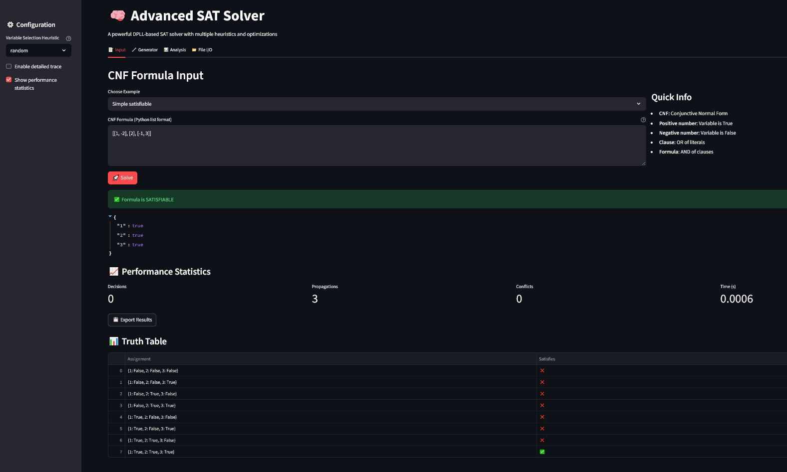
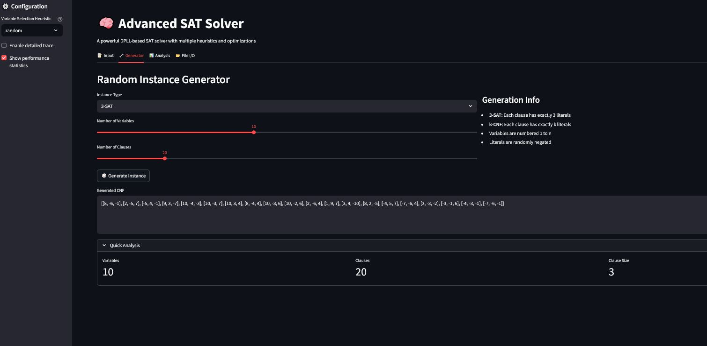
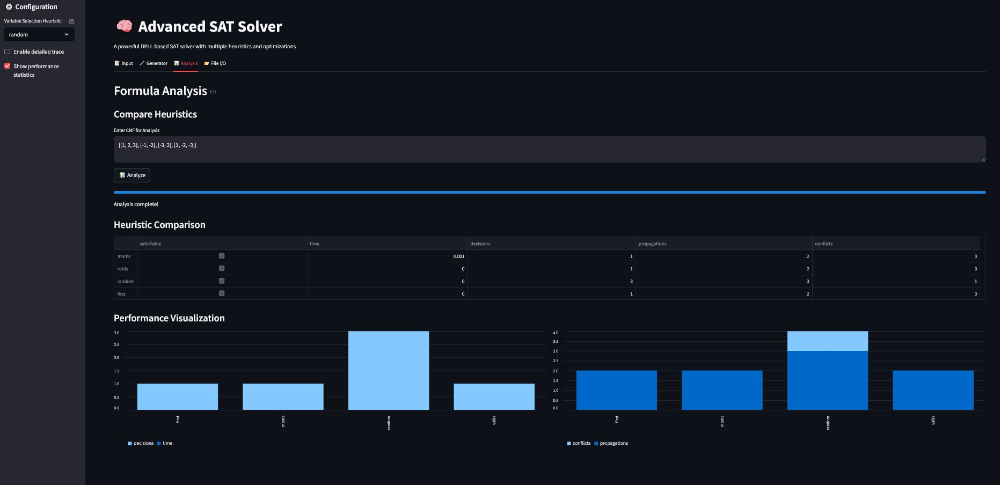
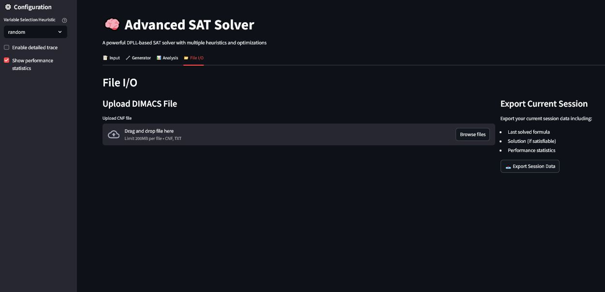

# SImple SAT Solver

A fully interactive SAT-solving environment built with **Python** and **Streamlit**, featuring an optimized **DPLL-based SAT solver**, multiple heuristics, solving trace visualization, CNF generators, heuristic benchmarking, and DIMACS file support.

---

## 🖼️ Screenshots  
(Displayed **in order**, not in a grid.)

### 1️⃣ Input & Solver View  
Shows CNF input, presets, solving output, statistics, trace, and truth tables.  


---

### 2️⃣ Random Instance Generator  
Create random 3-SAT or k-CNF instances with configurable sliders.  


---

### 3️⃣ Heuristic Analysis  
Compare heuristics such as MOMS, VSIDS, Random, and First.  


---

### 4️⃣ File I/O (DIMACS Import/Export)  
Upload `.cnf` DIMACS files for parsing and solving.  


---

## ✨ Features

### ✔️ DPLL-Based SAT Solver
- Unit propagation  
- Pure literal elimination  
- Watched literals  
- Branching heuristics:  
  - **MOMS**  
  - **VSIDS**  
  - **Random**  
  - **First-unassigned**

### ✔️ Visual Solving Trace  
Step-by-step breakdown of decisions, propagations, conflicts, and clause simplification.

### ✔️ Random CNF Generator  
- Random **3-SAT** formulas  
- Random **k-CNF** with selectable `k`  
- Auto-summary of variable + clause counts

### ✔️ Heuristic Benchmarking  
Evaluate multiple heuristics on:
- Runtime  
- Decisions  
- Propagations  
- Conflicts  

With visual bar charts.

### ✔️ DIMACS File Support  
Upload `.cnf` and `.txt` DIMACS CNF files.  
Includes:
- Parsing  
- Display  
- Solving  
- Exporting results to JSON  

### ✔️ Truth Table Generator  
For CNF formulas with ≤4 variables, a full truth table is generated.

---

## 🚀 Installation

```bash
python -r requirements.txt

streamlit run app.py
